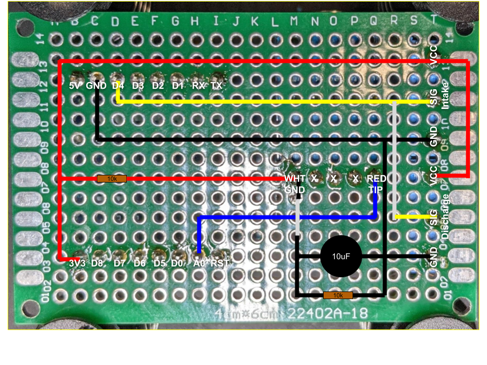
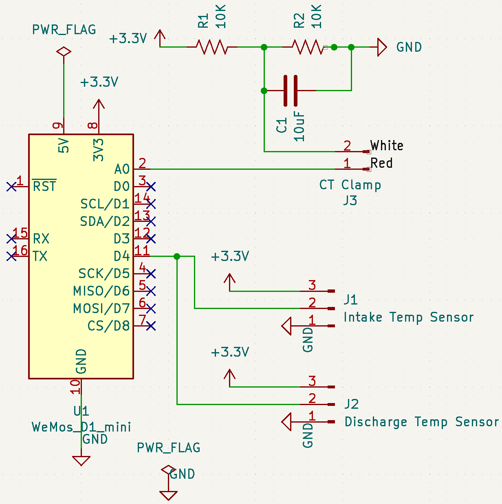
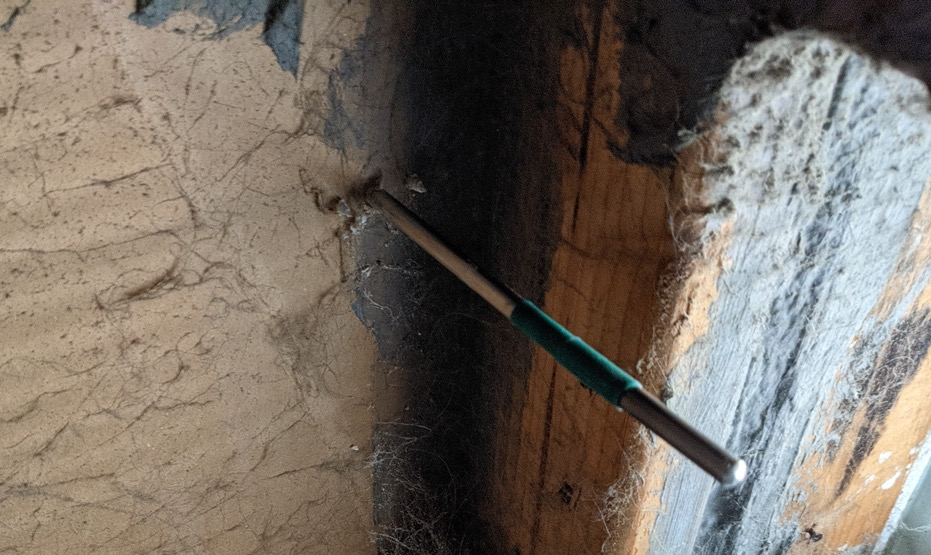
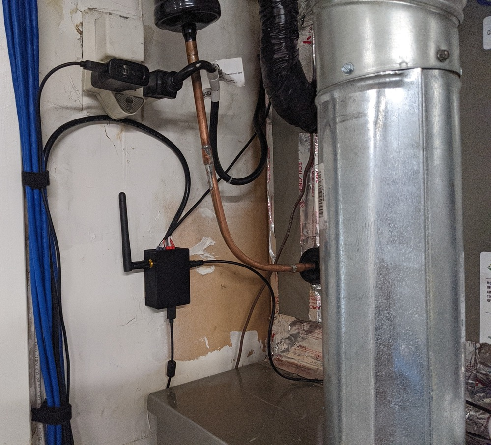

# Solution to monitor the performance of an HVAC system
HVAC continues to be one of the highest energy devices in our household yet even the more advanced systems don't contain monitoring or alerting components to let you know when something isn't working correctly. This can be both frustrating and costly. Modern cooling systems will run the fan and compressor continuously, even if they aren't working properly. This solution aims to provide a simple and cost effective way of monitoring the performance of your system and alerting you when there are problems. 

There are 3 components:
- ACWatcher
	- An ESP based device installed near your HVAC system to monitor the state of the system (system active, intake temperature and discharge temperature)
- ESPHome
	- The firmware running on ACWatcher to send sensor output to Home Assistant
- Home Assistant
	- Central home automation system capable of integrating with hundreds of IoT solutions
	- Tracks historical performance
	- Alerts to abnormal operating conditions

## Table of Contents
- [Solution to monitor the performance of an HVAC system](#solution-to-monitor-the-performance-of-an-hvac-system)
  - [Table of Contents](#table-of-contents)
  - [Disclaimers and Legal Stuff First](#disclaimers-and-legal-stuff-first)
  - [AC Watcher](#ac-watcher)
    - [BOM](#bom)
    - [Enclosures & Mounts](#enclosures--mounts)
    - [Assembly](#assembly)
  - [ESPHome](#esphome)
    - [Full configuration](#full-configuration)
    - [Finding the temperature sensor addresses](#finding-the-temperature-sensor-addresses)
    - [Calibrating the CT Clamp](#calibrating-the-ct-clamp)
  - [Temperature Probes](#temperature-probes)
    - [Temperature Probe Installation](#temperature-probe-installation)
    - [Final Mounting](#final-mounting)
  - [Home Assistant](#home-assistant)
  - [Possible Improvements](#possible-improvements)

## Disclaimers and Legal Stuff First
As an Amazon Associate I earn from qualifying purchases. I get commissions for purchases made through links in this post. Working with electricity is dangerous and can cause personal injury or DEATH as well as other property loss or damage if not used or constructed properly. If you have any doubts whatsoever about performing do-it-yourself electrical work, PLEASE do the smart thing and hire a QUALIFIED SPECIALIST to perform the work for you.

NEVER WORK WITH LIVE VOLTAGE. Always disconnect the power source before working with electrical circuits.

## AC Watcher
For my installation, I used an ESP8266 based Wemos D1 Mini Pro. I [modified](https://youtu.be/hXRcJXMjlyg?t=111) the antenna jumper to utilize the external antenna since the unit was installed in the garage. The Wemos D1 Mini is compact while providing a single ADC to capture current (is the system running) and multiple GPIOs to communicate with the temperature probes.
### BOM
| Qty | Device                                                     | URL                     |
| --- | ---------------------------------------------------------- | ----------------------- |
| 1   | Wemos D1 Mini Pro                                          | https://amzn.to/3xFy5fR |
| 2   | Dallas 1-wire temperature probes                           | https://amzn.to/3xP2s3L |
| 1   | Stainless Steel Straws                                     | https://amzn.to/3HeELol |
| 1   | YHDC Split Core Current Transformer Non-invasive SCT013-03 | https://amzn.to/3aVo3OQ |
| 1   | 40x60mm Perf Board                                         | https://amzn.to/39kikS4 |
| 2   | 10kOhm  1/4 Watt THT Resistors                             | https://amzn.to/3NIqNxz |
| 1   | 4.7kOhm  1/4 Watt THT Resistors                            | https://amzn.to/3zBT1G6 |
| 1   | 10uF 25v Electrolytic Capacitor                            | https://amzn.to/3xj8AQ9 |
| 2   | 3-pin PCB mount 5mm terminal block connectors              | https://amzn.to/3O9zOzy |
| 1   | 3.5mm female jack breakout board                           | https://amzn.to/3tssQgU | 

**Tools**: Soldering iron, solder, shrink tubing and wires

### Enclosures & Mounts

It helps significantly to have a 3d printer but you can always used shapeways.com or ask a friend to print these for you.

- [ACWatcher Case](3dfiles/Case.3mf)
- [ACWatcher Case Lid](3dfiles/Lid.3mf)
- 2 x [Temp Probe Mount](3dfiles/Temp%20Probe%20Holder.3mf)

### Assembly
Follow the diagram below to solder the main part into the perf board, making sure you adhere to the schematic.

**Schematic Wiring Diagram (From below)**



*I installed the capacitor and resistors on the top side of the board*


**ACWatcher Schematic**



Make sure to check all of your connections with a multimeter before you put it in the case. I also recommend getting ESPHome installed and working before putting it in the enclosure.

## ESPHome

Installing and configuring ESPHome is beyond the scope of this article, check out the great documentation over at https://esphome.io/

### Full configuration
Use the following configuration for your device replacing the wifi_ssid and password as well as your own IP ranges.

```
esphome:
  name: acwatcher

esp8266:
  board: d1_mini_pro

# Enable logging
logger:

# Enable Home Assistant API
api:
  encryption:
    key: "generated_by_the_system"

ota:
  password: "generated_by_the_system"

wifi:
  ssid: !secret wifi_ssid
  password: !secret wifi_password
  manual_ip:
    static_ip: 10.1.12.239
    gateway: 10.1.12.1
    subnet: 255.255.255.0

  # Enable fallback hotspot (captive portal) in case wifi connection fails
  ap:
    ssid: "Acwatcher Fallback Hotspot"
    password: "generated_by_the_system"

captive_portal:

dallas:
  - pin: D4
  
# Individual sensors
sensor:
  - platform: dallas
    address: 0x51000005d3a58b28 # Replace with your address
    id: discharge_temp
    name: "Discharge Temperature"
    filters:
      - lambda: return x * (9.0/5.0) + 32.0;
    unit_of_measurement: "°F"
    
  - platform: dallas
    address: 0x0e000005d3516128 # Replace with your address
    id: intake_temp
    name: "Intake Temperature"
    # Green band
    filters:
      - lambda: return x * (9.0/5.0) + 32.0;
    unit_of_measurement: "°F"
    
  - platform: ct_clamp
    sensor: adc_sensor
    id: hvac_current
    name: "HVAC Current"
    update_interval: 1s
    filters:
      - calibrate_linear:
        - 0 -> 0
        - 0.052 -> 4.3
    
  - platform: adc
    pin: A0
    id: adc_sensor
    
  - platform: template
    name: "Delta T"
    id: temp_delta_t
    update_interval: 60s
    unit_of_measurement: "°F"
    lambda: |-
      return (id(intake_temp).state - id(discharge_temp).state);

    
binary_sensor:
  - platform: template
    name: "HVAC State"
    lambda: |-
      if (id(hvac_current).state > 2) {
        return true;
      } else {
        return false;
      }
```

### Finding the temperature sensor addresses
Connect the temperature probes to the screw terminals and then power up the ACWatcher with a USB connection that allows you to view the debug logs. Shortly after startup, you should see 2 different device addresses. You will replace my device addresses with your own:

```
[20:05:51][C][dallas.sensor:075]: DallasComponent:
[20:05:51][C][dallas.sensor:076]:   Pin: GPIO2
[20:05:51][C][dallas.sensor:077]:   Update Interval: 60.0s
[20:05:51][D][dallas.sensor:082]:   Found sensors:
[20:05:51][D][dallas.sensor:084]:     0x0e000005d3516128 <--Here is the address of the temp sensor!
[20:05:51][D][dallas.sensor:084]:     0x51000005d3a58b28 <--Here is the address of the other temp sensor!
```

Replace the addresses and then restart again. Make sure you know which one is which. I used a piece of green shrink wrap on one and black on the other to differentiate. You can always just swap the addresses in the configuration if you get it wrong. 

At this point, you can insert the intake probe through the space where your air filter goes. You can use some electrical tape to temporarily attach the discharge probe to the vent, about 2-ft above the cooling coils. Power up your ACWatcher and watch the output in the logs to confirm you are seeing a decent difference in temperature while running the system. 
### Calibrating the CT Clamp 
Follow the excellent tutorial at https://esphome.io/components/sensor/ct_clamp.html#calibration for calibrating your CT Clamp. I recommend starting with a known good load (like a incandescent lightbulb) to calibrate your clamp. Precision isn't very important since we're only interested in finding out if the device is on or off.


Now that the clamp is calibrated. Open up your HVAC service cover and look inside for the electrical wiring. Look for the black wire, which should be thicker and clip the CT Clamp around it. Once again, check the logger output from ESPHome to make sure you are seeing an increase in current when the blower turns-on.

## Temperature Probes
I took a cue from the Honeywell HZ322 controller and designed a temperature probe similar to their solution. 3d print two of the [temperature probe holders](3dfiles/Temp%20Probe%20Holder.3mf). Make sure the holes are clear using a drill bit because you will want the **Stainless Steel Straw** to fit tightly. Depending on the depth of your vent, you may want to cut down the straw using a [tubing cutter](https://amzn.to/3Hf0BYM). If you do cut to tube, make sure to clean up the ends so you don't cut the cable while feeding it through. Next, press the straw into the temperature probe holder. Once I had it started, I placed the straw end flat on my work bench and pressed down hard until it was seated. Now feed the temperature probe through the straw and out the smaller hole in the back of the temperature probe holder. The finished product should look something like this.  


If everything looks correct, draw the temperature probe cabling into the body of the straw and then put another piece of shrink tubing on to stabilize the probe. Here is a view of the fully assembled probe, from inside the air return space.



Wire everything up again and make sure the probes are working correctly before the next step.

### Temperature Probe Installation
Starting with the intake probe, locate a portion of the duct work or blower/furnace mounting pedestal. Making sure you don't damage anything inside the space, drill a 1/4" hole into the area and slide the probe in. You can see my location in the image above coming through the sheetrock below my HVAC blower, just in front of the main air return for the house. Insert the probe and affix with two appropriately sized screws.

For the discharge probe, you will want to place the probe a few feet away from the blower to avoid damaging the probe when the heat is in use. Check out the [Honeywell DATS manual](https://manuals.plus/honeywell/c7735a1000-duct-air-temperature-sensor-manual) for guidance. You're likely going to be drilling into the duct work so carefully examine where you are drilling and make sure you won't damage anything inside the space. Carefully drill a 1/4" hole, just enough to penetrate the duct without the bit going too far in. Use a flashlight and make sure the space is clear before inserting the probe. If the hole looks good, place the probe into the hole and mark or drill two smaller holes for the temperature probe mount screw holes on either side of the main probe. Use sheet metal screws to affix the temperature probe mount to the duct work. One last time, connect it all up and check that everything is still working properly. 


### Final Mounting

At this point, find a good place to mount the ACWatcher, preferably not directly on the HVAC unit to avoid temperature problems. You can easily extend the temperature probe cabling up to ~50-ft without issue if needed. I used double-sided mounting tape but included an updated enclosure that has mounting tabs. 

## Home Assistant
Home Assistant has native access to ESPHome devices through the integrations panel. Take a look at https://esphome.io/guides/getting_started_hassio.html for details. Once the integration is configure properly, in Home Assistant, go to **Settings** -> **Add Integration** - **ESPHome** and enter the IP address of the ACWatcher. If you kept the same device names as I did in the device configuration, the following automation will work for you.

```
- id: cooling_problems
  alias: "Notify Cooling Problems"
  trigger:
    - platform: numeric_state
      entity_id: sensor.delta_t
      below: 15
      for: "00:10:00"
  condition:
    condition: and
    conditions:
    - condition: state
      entity_id: binary_sensor.hvac_state
      state: 'on'
      for: "00:05:00"
    - condition: numeric_state
      entity_id: sensor.discharge_temperature
      below: 80
  action:
    - service: notify.mobile_app_pixel_5
      data:
        message: 'HVAC appears to be ineffective. Please check it out.'
```

I'm sure I'll develop additional solutions and enhance this script once we're in the heating season, but it covers me for now. 

## Possible Improvements
It would be nice to know what mode the HVAC system was in (heating or cooling) so that I can track heating performance as well. Right now I just ignore the output if the discharge temperature is greater than 80°F. Thermostats control the system by closing the circuit on a 24V AC loop between the Y/yellow (cooling) wire and the C/black wire (common). Something like a ZMPT101B voltage sensor would allow you to step-down the 24VAC to 3.3v so you could measure with another ADC. A better solution would be to use a [24vac controlled relay](https://amzn.to/3txCOO7) for a simple on/off that I could connect to another GPIO.